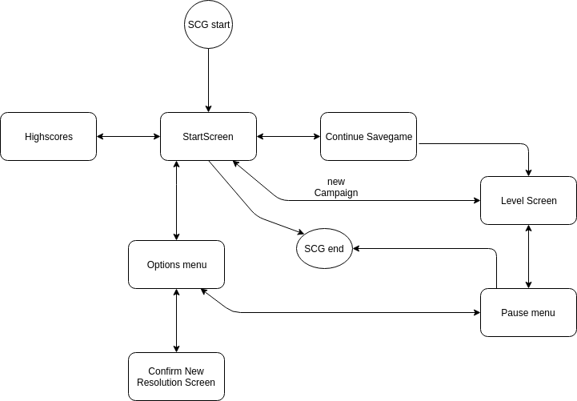
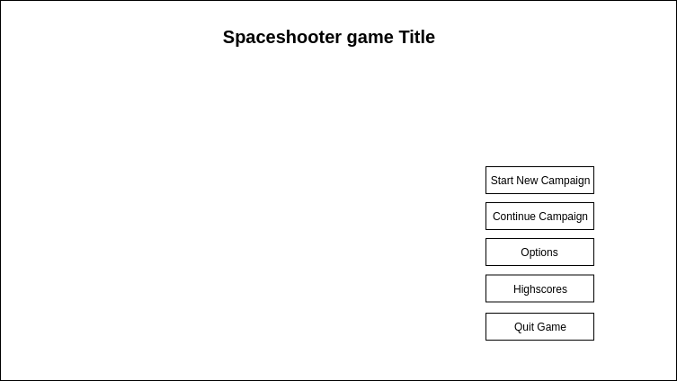
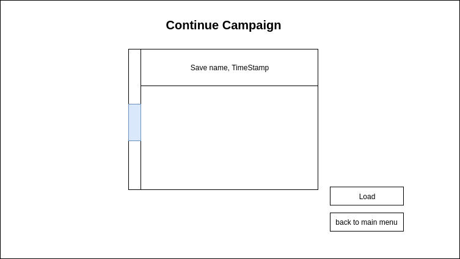
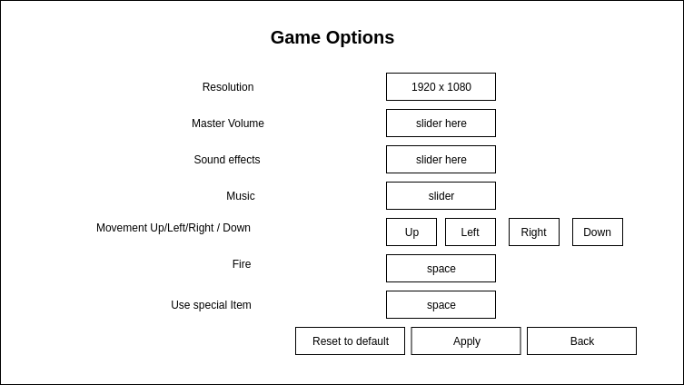
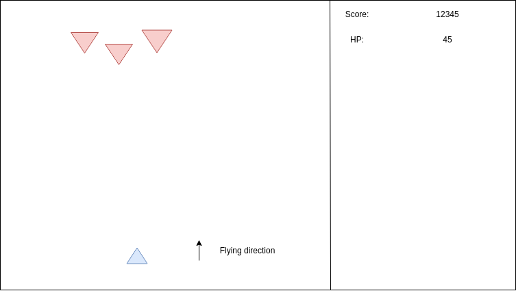
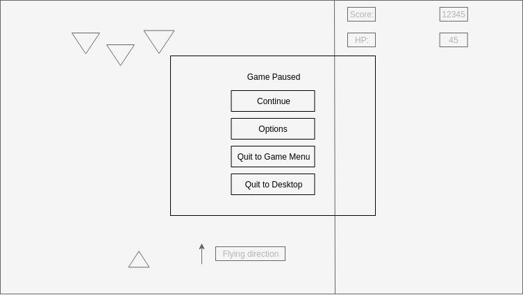

# spaceshooter game

- [spaceshooter game](#spaceshooter-game)
  - [Spec](#spec)
    - [Synopsis](#synopsis)
    - [Technical Terms](#technical-terms)
      - [Spaceshooter Game, a.k.a. “SCG”](#spaceshooter-game-aka-scg)
      - [Gameobject](#gameobject)
      - [Ship](#ship)
      - [Player controlled ship, a.h.a. “pcs”](#player-controlled-ship-aha-pcs)
      - [Hitpoints](#hitpoints)
      - [Damage](#damage)
      - [Collision Box](#collision-box)
      - [Damage Zone](#damage-zone)
      - [Projectile](#projectile)
      - [Barrier](#barrier)
      - [Beam](#beam)
      - [Enemy](#enemy)
      - [Medium Enemy](#medium-enemy)
      - [Boss Enemy](#boss-enemy)
      - [Empty Space](#empty-space)
      - [Level](#level)
      - [Screen](#screen)
      - [Campaign](#campaign)
      - [Savegame](#savegame)
      - [Score](#score)
  - [Design spec](#design-spec)
    - [The Game Systems](#the-game-systems)
      - [Screens](#screens)
        - [Screenmap](#screenmap)
        - [Start Screen](#start-screen)
        - [Continue Screen](#continue-screen)
        - [Options Screen](#options-screen)
        - [Confirm resolution screen](#confirm-resolution-screen)
        - [Highscores screen](#highscores-screen)
        - [Level screen](#level-screen)
        - [Pause screen](#pause-screen)
    - [Game Object Types](#game-object-types)
      - [Actual Game Objects](#actual-game-objects)
        - [Vessels](#vessels)
        - [Projectiles](#projectiles)
        - [Beams](#beams)
        - [Misiles](#misiles)
        - [Barriers](#barriers)
      - [Support Game Objects](#support-game-objects)
        - [Button](#button)
        - [Textindicator](#textindicator)
    - [Game world Design](#game-world-design)
      - [Campaign One](#campaign-one)
        - [Level One Earth](#level-one-earth)
          - [Level One Boss Enemy](#level-one-boss-enemy)
        - [Level Two Venus](#level-two-venus)
        - [Level Three Mercury](#level-three-mercury)
  - [Tech spec](#tech-spec)
    - [Data Analysis](#data-analysis)
      - [Global Data](#global-data)
      - [Start screen](#start-screen-1)
      - [options screen](#options-screen-1)
    - [Main Game Loop](#main-game-loop)
  - [Issues](#issues)
    - [nvidia open source driver crash](#nvidia-open-source-driver-crash)
      - [what should be improved:](#what-should-be-improved)

## Spec
### Synopsis
A 2D Vertical Scrolling Space Shooter, inspired by Cho ren scha.

### Technical Terms
#### Spaceshooter Game, a.k.a. “SCG”
The name of the game project.

#### Gameobject
Gameobjects are all the objects present in the actual game world itself. Excluded are things like Gui elements.

#### Ship
Is a Gameobject.
Can be either the Player controlled spaceship or an enemy spaceship.

#### Player controlled ship, a.h.a. “pcs”
A ship.
The Player controlled spaceship, can be referred to as: “pcs”


#### Hitpoints
Some Game Objects are destroyable and thus posses hitpoints.

#### Damage
Damage is the deduction of hitpoints.

#### Collision Box
Game Objects can have Collision Boxes. They are used to Determine Collision situations.

#### Damage Zone
Are Zone which will damage Game Objects passing through it.
Bomb
A Gameobject.
Bombs explode and create a Damage Zone for a certain time upon their explosion.

#### Projectile
A Gameobject.
A Projectile travels across the gameworld and can inflict damage upon collision with another gameobject. More details see: Todo: Write Projectile collision algorithm, and reference it.

#### Barrier
Barriers are indestructible Damage Zones, they are basically the “Level” itself, for example Rocks where some Enemies can be sitting. Barriers can be completely static or scripted.

#### Beam
Beams are Damage Zones in the shape of lines. They can be emitted by pcs or Enemies.

#### Enemy
The other Ships in the game, the objective of this game is to avoid their Projectiles and Beams and destroy them.

#### Medium Enemy
A type of Enemy, it is a little bit more challenging than the typical one and is encountered in the middle of the level.

#### Boss Enemy
This is the Last enemy of a level it must be destroyed in order to get to the next level.

#### Empty Space
The default space, can be traversed by Gameobjects.

#### Level
One unit of gameplay, each Level has a couple of Waves of enemies and an Bossenemy, the Boss enemy must be defeated, if this has been managed, then the Level is completed.

#### Screen
A Screen represents an interactable Unit of the Entire Game for example when you start the Program then the first Screen loaded is the Init screen where the Player can choose to begin a new game or load a level. See: Screens

#### Campaign
Campaign is a sequence of Levels which get progressively Harder. The Player may start a new Campaign and save her progress after each completed level. When all Levels of the campaign are completed, then the Campaign is completed.

#### Savegame
During an Campaign the Player can Save after each Level completed. This will create a Save Game. This Save Game can be continued later.

#### Score

For each Enemy defeated the Player gets rewarded Points. During a Campaign the Score is getting carried over from completed level to level, unless the pcs gets destroyed, upon destruction the score is reseted to 0. Upon Campaign completion the player can enter her name into an High Score list.

## Design spec
### The Game Systems
This chapter describes the Interaktive Game Systems of the SCG

#### Screens
SCG is divided up into different Screens. The Player can go from Screen to screen and thus they build a tree of screens which can be navigated through.

##### Screenmap
The navigation map:




##### Start Screen


From the start screen the user can access the other functions of SCG.

##### Continue Screen



##### Options Screen


Resolution settings: Player can choose between supported Resolutions, after choosing the new resolution the User must confirm it in an seperate screen.

##### Confirm resolution screen


##### Highscores screen

Displays the named highscores, ordered descending by score (1st column). Second Column is the actual highscore.

##### Level screen


Example Level scene, showing the pcs in blue and 3 enemies in red.

##### Pause screen



### Game Object Types
#### Actual Game Objects
##### Vessels
Vessels are the Spaceships both the player controlled one and the enemies. They are animated, they can have these animation types:

- Idle
- Attack
- Damaged(can have more animation types depending on the amount of damage)
- Death
- Appearing (when the enemies come from hyperspace)

##### Projectiles
Are objects which can colide with Vesells, for instance the pcs can shoot projectiles which then follow a trajectory and can colide with other objects for example enemy Vessels. The key difference between Projectiles and [Beams](#beams). Projectiles do not lock on to their target instead they will follow a linear trajectory.

##### Beams
Beams are elongated damagezones which will exist for a certain amount of time. They will be created between two points and for the time the beam exist, the damage zone will be maintained.

##### Misiles
Misiles behave like Projectiles, but will lock on to their target, they can be shot down by projectiles are Beams.

##### Barriers
Bariers are inpenetrable objects wich will cause projectiles and vesells to die upon contact.

#### Support Game Objects
##### Button
Is a clickable object which can have a callback for example start the game etc.

##### Textindicator
This is a label which can be updated with dynamic content. For Example the number of Hitpoints etc.

### Game world Design
#### Campaign One
In the first campaign we will first defend the Alien invasion in earth orbit, then we will pursuit the aliens to their bases on Venus and Mercury.

##### Level One Earth

Color palette:
<span style="color:#335452">█</span><span style="color:#585A7D">█</span><span style="color:#808BF0">█</span><span style="color:#9FC7D5">█</span><span style="color:#9E9F67">█</span>


We will defend Earth from the Alien invasion, the level is set in earths orbit. 

###### Level One Boss Enemy
"Protected Beam Emiter"
The Protected beam emiter has three Energy barriers, they are impervious to all damage, so in order to defeat the boss the player needs to destroy the Barier generators which are hard to hit orbs swirling around the Boss. The Boss itself will shoot lots of beams in repeating patterns which are not aimed at the pcs but will fill out the screen more or less creating lots of damage zones. Then there will be Projectiles which the Boss enemy will aim at the pcs

##### Level Two Venus
After defeating the alien invasion in earths orbit we are fighting the alien base in the orbit of venus.

##### Level Three Mercury


## Tech spec
This chapter is all about the architecture of the app.

### Data Analysis

#### Global Data

*selected ui Elements*
|screenID (unique)|ui ElementID|default|
|---|---|---|
|1|2|2| 

Example: screen ID 1 = Start Screen, ui ElementID 2 = Start New Campaign, only one ui element can be selected per Screen

*audiosettings*
|settingname|value|defaultValue|
|---|---|---|
|masterV %|u8|100|
|SFXV %|u8|100|
|musicV %|u8|100|


*resolution settings*
|dimension|value|defaultValue|
|---|---|---|
|resX|u16|800|
|resY|u16|600|

*controls settings*
|inputname|value|defaultValue|
|---|---|---|
|up |u8|upkey|
|left |u8|leftkey|
|right |u8|rightkey|
|down |u8|downkey|
|Fire |u8|spacekey|
|special item |u8|control|


#### Start screen


*labels / buttons*
|id|Label|posx %|posy %|width %|height %|backgroundColor|fontColor|screenID (1 for all Start Screen Elements)|
|---|---|---|---|---|---|---|---|---|
|1|Spaceshooter Game Title|u16|u16|u16|u16|u32|u32|
|2|Start New Campaign|u16|u16|u16|u16|u32|u32|
|3|Continue Campaign|u16|u16|u16|u16|u32|u32|
|4|Options|u16|u16|u16|u16|u32|u32|
|5|Highscores|u16|u16|u16|u16|u32|u32|
|6|Quit Game|u16|u16|u16|u16|u32|u32|


#### options screen

*labels / buttons*
|id|Label|posx %|posy %|width %|height %|backgroundColor|fontColor|screenID (1 for all Option Screen Elements)|
|---|---|---|---|---|---|---|---|---|
|1|Game Options|u16|u16|u16|u16|u32|u32|
|2|Resoulution|u16|u16|u16|u16|u32|u32|
|3|Master Volume|u16|u16|u16|u16|u32|u32|
|4|Sound Effects|u16|u16|u16|u16|u32|u32|
|5|Music|u16|u16|u16|u16|u32|u32|
|6|up/left/right/down|u16|u16|u16|u16|u32|u32|
|7|fire|u16|u16|u16|u16|u32|u32|
|8|use special item|u16|u16|u16|u16|u32|u32|
|9|reset to default|u16|u16|u16|u16|u32|u32|
|10|apply|u16|u16|u16|u16|u32|u32|
|11|back|u16|u16|u16|u16|u32|u32|


### Main Game Loop

Overview of the main game loop:

```
initialize GameSystems

sceneDataStack.Push(LoadFirstSceneData())
# scene switcher loop
while (scendeDataStack.hasAny())
  currentSceneData = sceneDataStack.Pop()


  # secene loop
  while (!SceneOver(currentSceneData))
    deltaT = ComputeDeltaT
    inputLists= QueryInputs

    # step 1:
    ## decide on whethere to pick a new scenedata or not
    ## in case new scenedata, push it on the stack

    # step 2:
    ## compute movements

    # step 3:
    ## compute collision with scenedata


    # step 4:
    ## compute animations with scenedata

    # step 5:
    ## compute sfx with scenedata

    # step 6:
    ## render the scene data
    

deinitialize gameSystems

```


## Issues
### nvidia open source driver crash
will crash with open source driver (nouveau) when its running on linux

#### what should be improved:
make it so that it no longer panics but gracefully shuts down.


